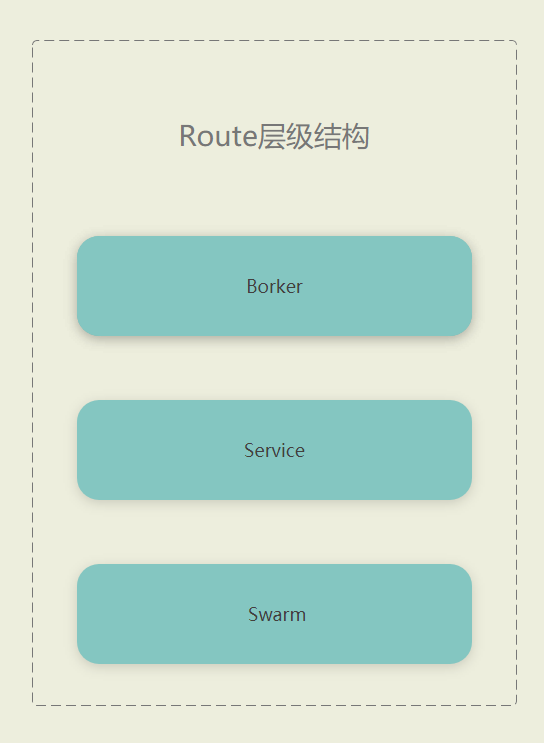
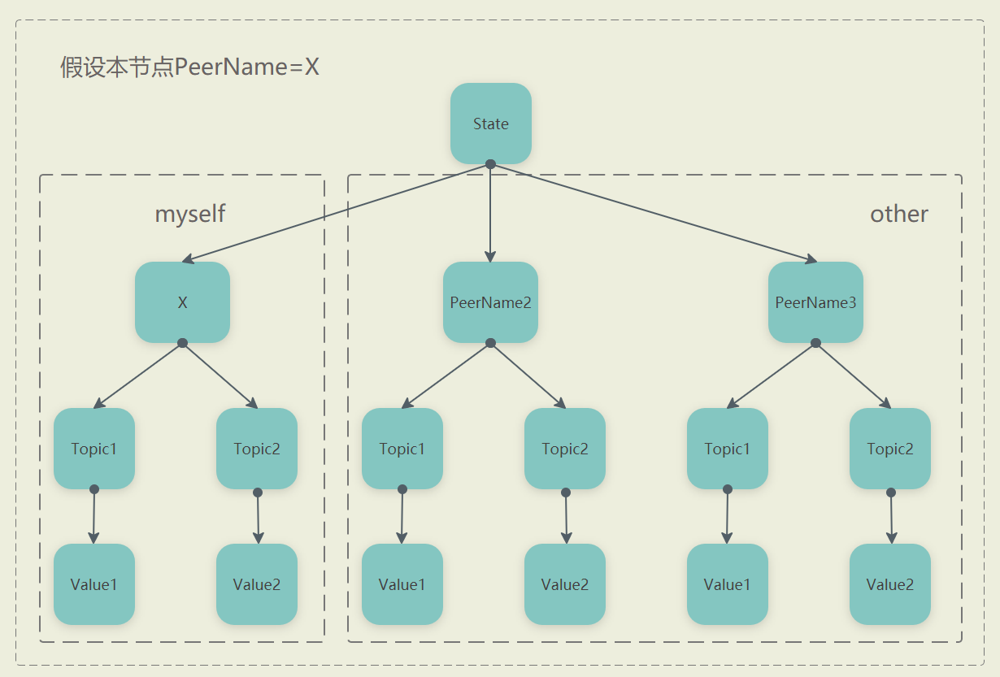
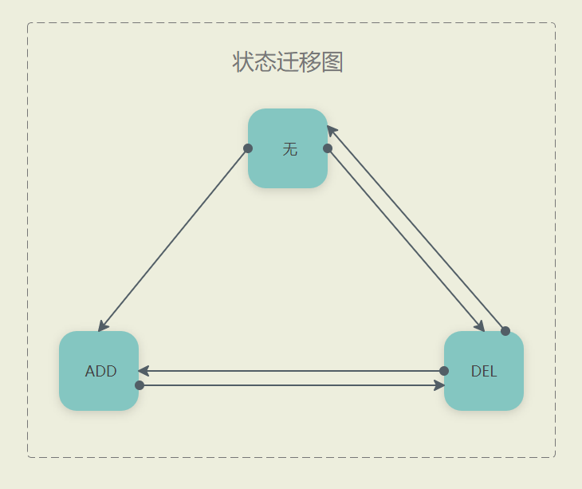

# Route设计文档

<br>

## 1.概述

Route是分布式的订阅发布系统,保证了CAP中的AP,并且实现了最终一致性

Route总体可以分为三大模块,如下图:

<br>



<br>

## 2. Broker

1. Broker主要负责维持客户端的连接,读取连接来的请求,以及将请求的处理结果返回给连接,所做的事情比较简单

2. Broker目前只支持Websocket协议

## 3. Service

1. Service主要职责是处理Broker或者Swarm转发过来的请求

2. 目前的请求类型由4种: LocalBatchTopicOp(内含Sub,Unsub),LocalQuery,BatchPubMessage

3. 为什么要把Sub和Unsub请求放在同一个结构体呢?其实是利用Chan的特性来保证订阅操作FIFO特性(例如:先Sub后Unsub,先Unsub后Sub将会产生不同的结果)

4. Broker来的BatchPubMessage和Swarm来的BatchPubMessage的处理行为有些许不一样

    - Broker: 会推送给所有订阅该Topic的订阅者

    - Swarm: 只会推送给订阅该Topic并且 `LocalSubscriberType == LocalSubscriberDirect`  的订阅者
5. Service内部维护着一个 Topic->List<Subscriber> 的map, 内部协程结构为1+N,1个主协程,所有map操作只能由主协程执行。N个IO协程,主要将结果写入到对应的订阅者(写入都是IO操作)

6. 对于`Subscriber`接口有两个比较关键的方法,`ID()`标识订阅者具有唯一性,`ConcurrentId()`主要用于防止IO并发写入问题

## 4. Swarm

Swarm主要负责集群状态的互相同步,以及新节点的发现

Swarm维护着一个类CRDT状态(下面简称为`state`),其Proto文件为:
```protobuf
package crdt;


message State {
    map<uint64, TopicMap> set = 1;
}

message TopicMap {
    map<string, int64> map= 1;
}
```

其含义如下图:



- 第2层的PeerName每个节点都有,在集群范围内唯一
- 第3层表示订阅的Topic
- 第4层是个int64,是TimeStamp+IsAdd(Add状态可以等同于此Topic被订阅的意思)的组合,最低位代表着IsAdd,其63位表示最后更新IsAdd的毫秒时间戳


对于某个Topic都可能出现以下状态迁移:



但是myself和other的Topic状态迁移会有些许不同：


### 4.1 myself

| local \ remote | ADD | DEL |
| --  | -- | -- |
| 无 | 强制合并为DEL  | DELTime如果还没过期则合并为DEL状态,否则则忽视 |
| ADD | 由于remote的TimeStamp不可能大于local的,所以都是忽视此变更(如果出现说明是未知错误)  | 强制合并为ADD |
| DEL | 由于remote的TimeStamp不可能大于local的,所以都是忽视此变更(如果出现说明是未知错误) | 取两者最新的版本(由于存在节点断线重连的情况,所以取最新版本) |

特别的: 每过一段时间会对State进行扫描删除DELTime已经过期的Topic,从而将状态从DEL转为无(gc)

值得注意的是,myself区域绝大部分TopicMap状态变化只能是本节点自己更新(其他节点只是合并更新),只有一种情况除外:当本节点断线时,其他节点会强制设置myself区域的TopicMap所有item为Del状态并且DelTime时间

### 4.2 other

| local \ remote | ADD | DEL |
| --  | -- | -- |
| 无 | 合并为ADD  | DELTime如果还没过期则合并为DEL状态,否则则忽视 |
| ADD | 取两者最新的版本  | 取两者最新的版本 |
| DEL | 取两者最新的版本 | 取两者最新的版本 |

特别的: 每过一段时间会对State进行扫描删除DELTime已经过期的Topic,从而将状态从DEL转为无(gc)
